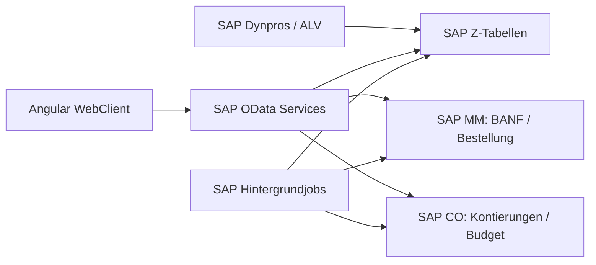

# xTS Entwicklungskonzept v0.1

> **Release-Abgrenzung 26.09.2026 (Entscheidung 23):** Im aktuellen Release erfasst xTS Leistungsstunden und zeigt SAP-Planung, Belege und Genehmigungsstatus nur lesend. Planung, Genehmigung/Rueckweisung, Beauftragung/BANF/Bestellung und WE erfolgen ausschliesslich in SAP. Die vorhandenen weitergehenden Frontend-Funktionen bleiben fuer spaeter erhalten, sind fuer diesen Release aber in UI und schreibenden API-Pfaden zu deaktivieren. **Noch nicht technisch umgesetzt.** Nachfolgende Beschreibungen des bisherigen Vollumfangs sind keine aktuelle Release-Freigabe. Massgeblich ist der [Release-Zuschnitt](release-zuschnitt.md); offene Fachfragen bleiben offen.

Stand: 2026-05-08  
Basis: `xTS - Konzept.xlsx`, `xTS - Ressourcenplanung und Stundenschreibung.pptx` und `xTS Entwicklungskonzept v0.docx`

## 0. Umsetzungsstand (2026-09-06)

Dieses Dokument ist die fachliche Baseline v0.1 vom 2026-05-08 und wird nicht fortgeschrieben. Der umgesetzte Stand steht in `odata-contracts.md` (Services und Verhalten), `entscheidungen-v0.1.md` (Entscheidungen) und `audit-2026-09-03.md` (Luecken). Bekannte Abweichungen der Umsetzung von dieser Baseline:

| Thema                               | Baseline (dieses Dokument)                                                                                     | Umsetzung                                                                                                                                                                                                                           |
| ----------------------------------- | -------------------------------------------------------------------------------------------------------------- | ----------------------------------------------------------------------------------------------------------------------------------------------------------------------------------------------------------------------------------- |
| Frontend (§2, §9)                   | Web-Frontend nur fuer Stundenschreibung; SAP-Dynpros fuer Admin, Planung, Beauftragung, Genehmigung, Reporting | Alle Screens sind im Angular WebClient umgesetzt (`/`, `/approvals`, `/reports`, `/planning`, `/orders`, `/admin`); §9 beschreibt sie bereits als Screens. SAP-Dynpros koennen ergaenzend folgen.                                   |
| Regelwerk Infotyp 1 (§7.2)          | Regelwerte `K` (Kontierung) und `Z` (Zeitraum)                                                                 | Ein Regelwert `MA_KONT` (Aggregation je Mitarbeiter und Kontierung, Entscheidung 3); Zeitraumaggregation ist nicht umgesetzt.                                                                                                       |
| OData-Pfade (§8)                    | `PlanningRows`, `Assignments`, `ApprovalItems/ApproveDay`, `HoursQuotaMonitor`, `PATCH`/`Submit`               | Fuehrend ist `odata-contracts.md` (`PlanningEntries`, `Orders`, `TimesheetApprovals`, `CostObjectQuota`, `POST`-Upserts). OData V2 ist entschieden (Entscheidung 17, Zielsystem SAP ECC); Antwortformen siehe `odata-contracts.md`. |
| Status `L` geloescht (§6)           | Fuer Planung und Stundenschreibung vorgesehen                                                                  | Nicht umgesetzt; Stundenzettel koennen nicht geloescht werden, Stammdaten werden logisch geloescht (`deleted`).                                                                                                                     |
| Teamzuordnung in Planung (§10)      | Mitarbeiter braucht gueltige Teamzuordnung im Planzeitraum                                                     | Planungszeilen entstehen aus Mitarbeiter-Kontierungs-Zuordnungen; die Teamzuordnung filtert, ist aber nicht Pflicht (Audit Nr. 22).                                                                                                 |
| `MyEnabledCostObjects?date=` (§8.4) | Serverseitige Filterung nach Datum                                                                             | Parameter wird ignoriert; Gueltigkeit wird beim Speichern serverseitig und in der Anzeige clientseitig geprueft.                                                                                                                    |
| Mitarbeiterstamm (§7.1)             | Ohne Login-Attribute                                                                                           | `AAD_OID` und `AAD_UPN` ergaenzt (Entscheidung 6, Option B).                                                                                                                                                                        |
| Tageskopf (§7.3)                    | `ARBEITSZEIT` als gespeichertes Feld                                                                           | `workHours` wird serverseitig berechnet; neues Feld `varianceReason` (Abweichungsbegruendung) bei Differenz zur Positionssumme.                                                                                                     |
| Protokoll                           | Nicht im Datenmodell                                                                                           | `ZXTS_LOG_T`-Simulation (Audit-Log) mit `GET /odata/AuditLog`.                                                                                                                                                                      |
| Wareneingang (§5.6, XTS-061A)       | Bestellposition eindeutig ermitteln, Fehlerfall, Wiederholung                                                  | Im Mock ein fortlaufender WE-Beleg ohne Bestellpositionsbezug (Audit Nr. 34); SAP-seitig offen.                                                                                                                                     |

## 1. Zielbild

xTS ist ein internes System zur Planung, Beauftragung, Stundenschreibung, Genehmigung und Auswertung externer bzw. projektbezogener Ressourcen.

Das System verbindet:

- Ressourcenplanung auf Mitarbeiter-, Team-, Kontierungs- und Monatsbasis.
- Beauftragungsprozess mit BANF und Bestellung.
- Stundenschreibung über ein Web-Frontend.
- Genehmigung der erfassten Leistungen durch Projektleitung.
- Reporting zu Budget, Stundenkontingenten, Plan-/Ist-Abgleich und Einkaufsbelegen.

SAP bleibt im Zielbild führend für Kontierungen, Einkaufsbelege, Bestellungen, Wertefluss und zentrale Berechtigungs-/Stammdatenlogik. xTS ergänzt SAP um einen fachlich geführten Prozess und ein nutzerfreundliches Frontend für Planung und Zeiterfassung.

## 2. Leitentscheidungen fuer v0.1

Diese Entscheidungen sind als fachlich bestaetigte Basis fuer den Entwicklungsstart gesetzt. Details stehen im Entscheidungslog.

| Thema                           | Entscheidung v0.1                                                                                                                            |
| ------------------------------- | -------------------------------------------------------------------------------------------------------------------------------------------- |
| Fuehrendes System               | SAP ist fuehrend fuer Kontierung, BANF, Bestellung und Wertefluss.                                                                           |
| Frontend                        | Web-Frontend fuer Stundenschreibung; SAP-Dynpros bzw. SAP UI fuer Admin, Planung, Beauftragung, Genehmigung und Reporting im MVP.            |
| Backend                         | SAP Z-Tabellen plus OData-Services; optionale Java-Middleware erst nach MVP-Validierung.                                                     |
| Planungseinheit                 | Mitarbeiter + Kontierung + Monat.                                                                                                            |
| Planungshorizont                | 12 Monate ab eingegebenem Startmonat.                                                                                                        |
| Beauftragung                    | Startet aus freigegebenen Planstunden; Aggregation nur pro Mitarbeiter und Kontierung.                                                       |
| BANF / Bestellung               | xTS legt MM-BANF aktiv an; MM-Bestellung wird per Job nachgelesen.                                                                           |
| Freischaltung Stundenschreibung | Regelbasiert ueber `ZXTS_REGELN_T`; MVP-Start ab vorhandener BANF mit Regelwert `P`, spaeter auch ab Bestellung mit Regelwert `B` steuerbar. |
| Genehmigung                     | Genehmigung bzw. Zurueckweisung erfolgt tageweise, wirkt auf alle Stundenpositionen eines Tages.                                             |
| Folgeprozess nach Genehmigung   | Nach Status `G` soll synchron ueber einen ausloesenden Button ein Wareneingang zur zugehoerigen Bestellposition gebucht werden.              |
| Authentifizierung               | WebClient via AD/OAuth; Mapping auf `EXTNR`, SAP-User optional.                                                                              |
| Budget                          | Stundenbudget ist fuehrend; Budgetbetrachtung ab Status `P` bzw. BANF erstellt.                                                              |
| Reporting                       | Im MVP SAP ALV-orientierte Reports; Dashboard-UI spaeter moeglich.                                                                           |

## 3. MVP-Scope

### Im MVP enthalten

1. Stammdatenpflege fuer Mitarbeiter, Teams, Teamzuordnung und Kontierungen.
2. Ressourcenplanung pro Mitarbeiter, Kontierung und Monat auf Stundenbasis.
3. Freigabe von Planstunden fuer Beauftragung; Aggregation regelbasiert.
4. Anlage bzw. Pflege einer Mitarbeiterbeauftragung mit BANF-/Bestellbezug.
5. Regelbasierte Freischaltung der Stundenschreibung.
6. Web-Stundenschreibung mit Tageskopf und mehreren Leistungspositionen.
7. Statusmodell fuer Erfassung, Freigabe, Genehmigung und Zurueckweisung.
8. Genehmigungsmaske fuer Projektleiter.
9. Budget-Monitor, Stundenkontingent-Monitor und Ressourcen-Live-Circle als erste Reports.
10. Wareneingangsbuchung zur Bestellung nach genehmigten Stunden.

### Nicht im MVP enthalten

1. Vollautomatische Rechnungspruefung.
2. Automatischer Zahllauf.
3. Gutschriftsverfahren.
4. Vollstaendige Obligobereinigung.
5. Vollwertige Abwesenheitsplanung.
6. Komplexe Java-Middleware-Workflows.
7. Native mobile App.
8. Aktive Anlage oder Aenderung von MM-Bestellungen.

## 4. Rollen und Berechtigungen

| Rolle                           | Aufgaben                                                                 | SAP-/xTS-Berechtigung                         |
| ------------------------------- | ------------------------------------------------------------------------ | --------------------------------------------- |
| xTS User                        | Eigene Stunden erfassen, freigeben, Status einsehen                      | WebClient-Berechtigung via AD/OAuth           |
| Ressourcenmanager / Teamleitung | Mitarbeiter planen, Teamzuordnung pflegen, Kapazitaeten pruefen          | `Z_F_BC_xTS_PLANER`                           |
| Order Manager / Einkauf         | BANF/Bestellung anlegen oder ueberwachen, Einkaufsstatus rueckschreiben  | Einkaufs-/SAP-Berechtigungen plus xTS Zugriff |
| Projektleiter                   | Stunden genehmigen oder zurueckweisen, Budget und Ist-Verbrauch einsehen | `Z_F_BC_xTS_PROJEKTLEITER`                    |
| xTS Administrator               | Stammdaten, Regeln, Ampelwerte und Customizing pflegen                   | `Z_F_BC_xTS_USER` plus Adminrechte            |
| Controlling                     | Reporting, Budget- und Werteflussauswertung                              | Reporting-Berechtigung                        |

## 5. End-to-End-Prozess

### 5.1 Stammdatenpflege

1. Mitarbeiter werden in `ZXTS_WIW_T` gepflegt.
2. Teams werden in `ZXTS_TEAM_T` gepflegt.
3. Mitarbeiter werden zeitlich gueltig Teams zugeordnet in `ZXTS_MATEAM_T`.
4. Kontierungen werden in `ZXTS_KONT_T` gepflegt bzw. aus SAP CO/Einkauf referenziert.
5. Optional werden Budgetinformationen und Ampelwerte fuer den Budget-Monitor gepflegt.

### 5.2 Ressourcenplanung

1. Ressourcenmanager oeffnet die Planungstransaktion.
2. Startmonat wird im Format `MM.YYYY` eingegeben.
3. System zeigt 12 Monate ab Startmonat.
4. Filter moeglich nach Mitarbeiter, Team und Kontierung.
5. Planstunden werden pro Mitarbeiter, Kontierung und Monat erfasst.
6. System prueft:
   - Gueltige Teamzuordnung im Planungszeitraum.
   - Gueltige Kontierung.
   - Loeschkennzeichen.
   - Ueberplanung gegen SAP-Werkkalender.
7. Neue oder geaenderte Planwerte erhalten Status `V` bzw. bleiben aenderbar, solange kein harter Folgeprozess gestartet wurde.
8. Ressourcenmanager setzt Planstunden auf `F`, um sie fuer Beauftragung freizugeben.

### 5.3 Beauftragung

1. Beauftragungsprozess liest Planungsdatensaetze mit Status `F`.
2. Abhaengig von `ZXTS_REGELN_T` werden Planstunden zusammengefasst:
   - Nur innerhalb eines Mitarbeiters.
   - Gleiche Kontierung.
   - Ggf. gleicher Zeitraum.
3. Beauftragungsposition wird in `ZXTS_MABEAUF_T` angelegt.
4. BANF-Positionstext kann manuell gepflegt werden.
5. xTS legt die MM-BANF aktiv an; BANF-Nummer und BANF-Position werden rueckgeschrieben.
6. Die MM-Bestellung wird nicht aktiv durch xTS erzeugt oder geaendert, sondern per Hintergrundjob nachgelesen.
7. Status in Planung bzw. Beauftragung wird aktualisiert:
   - `P` bei BANF vorhanden.
   - `B` bei Bestellung vorhanden.

### 5.4 Freischaltung Stundenschreibung

1. System prueft `ZXTS_REGELN_T` fuer Infotyp `2`.
2. Regel entscheidet, ob BANF (`P`) oder Bestellung (`B`) fuer Freischaltung ausreicht.
3. Fuer den MVP-Start ist BANF vorhanden der erste Freischaltpunkt; Bestellung vorhanden bleibt als spaetere bzw. alternative Regel vorgesehen.
4. Freigegebene Kontierungs-/Mitarbeiterkombinationen werden in `ZXTS_MAZUKONT_T` bereitgestellt.
5. Dort werden beauftragte Stunden, bereits gebuchte Stunden und offene Stunden gehalten.

### 5.5 Stundenschreibung

1. Mitarbeiter meldet sich im WebClient an.
2. System ermittelt externe Nummer, Berechtigungen und freigeschaltete Kontierungen.
   - Offen fuer technische Spezifikation: Welches AD/OAuth-Attribut wird auf `ZXTS_WIW_T-EXTNR` gemappt?
3. Mitarbeiter erfasst Tagesdaten:
   - Datum.
   - Kommt-Zeit.
   - Geht-Zeit.
   - Pause.
   - Leistungsort.
4. Mitarbeiter erfasst eine oder mehrere Leistungspositionen:
   - Kontierung.
   - Leistungsbeschreibung.
   - Stunden.
5. System prueft:
   - Summe der Positionsstunden gegen Tagesarbeitszeit.
   - Offene Stunden der Kontierung.
   - Gueltige Kontierung fuer Mitarbeiter und Zeitraum.
   - Statusaenderbarkeit.
6. Bei Speichern bleibt Status `E`.
7. Bei Freigabe wird Status `F` gesetzt und die Daten sind fuer den Mitarbeiter nicht mehr aenderbar.

### 5.6 Genehmigung

1. Projektleiter selektiert Leistungsmonat und optional Mitarbeiterbereich.
2. System zeigt freigegebene Stunden mit Status `F`.
3. Projektleiter markiert einen vollstaendigen Arbeitstag.
4. Bei Genehmigen:
   - Alle Positionen des Tages wechseln auf `G`.
   - Datensatz ist im WebClient nur noch sichtbar, nicht mehr aenderbar.
   - Eine synchrone Wareneingangsbuchung zur zugehoerigen Bestellposition wird ueber den Genehmigungs-/WE-Button angestossen.
5. Bei Zurueckweisen:
   - Alle Positionen des Tages wechseln auf `A`.
   - Rueckweisungsgrund wird verpflichtend erfasst.
   - Datensatz wird fuer Mitarbeiter wieder aenderbar.

### 5.7 Reporting

MVP-Reports:

1. Ressourcen-Live-Circle `ZXRLM`
   - Von Planung ueber Beauftragung bis Rechnung/Wertefluss.
   - Planstunden, Ist-Stunden, Bestellmenge, Bestellpreis, Wareneingang, Rechnung.
2. Budget-Monitor `ZXBM`
   - Kontierung, Budgetstunden, verbrauchte Stunden, Verbrauch in %, Reststunden.
   - Fuehrend ist Stundenbudget; verbindliche Budgetbetrachtung ab Status `P` bzw. BANF erstellt.
   - Ampelsteuerung ueber Customizing.
3. Stundenkontingent-Monitor `ZXSTD`
   - Mitarbeiterbezogene Sicht auf freigegebene, gebuchte und offene Kontingente.
   - Optional tagesbezogene Detailanzeige.

## 6. Statusmodell

### 6.1 Planung / Beauftragung

| Status | Bedeutung                     | Aenderbar?                      | Naechster Schritt                                           |
| ------ | ----------------------------- | ------------------------------- | ----------------------------------------------------------- |
| blank  | Noch nicht geplant            | Ja                              | Planstunden erfassen                                        |
| `V`    | Vorgemerkt                    | Ja                              | Planung freigeben                                           |
| `F`    | Fuer Beauftragung freigegeben | Eingeschraenkt / nein           | BANF anlegen                                                |
| `P`    | BANF angelegt                 | Nein fuer beauftragten Zeitraum | Stundenschreibung freischalten und Bestellung nachlesen     |
| `B`    | Bestellung vorhanden          | Nein fuer beauftragten Zeitraum | Stundenschreibung fortfuehren / Bestellstatus dokumentieren |
| `L`    | Geloescht                     | Nein                            | Ausblenden / historisieren                                  |

### 6.2 Stundenschreibung

| Status | Bedeutung                   | Aenderbar durch Mitarbeiter? | Aenderbar durch Projektleiter?                |
| ------ | --------------------------- | ---------------------------- | --------------------------------------------- |
| `E`    | Erfasst                     | Ja                           | Nein                                          |
| `F`    | Zur Genehmigung freigegeben | Nein                         | Ja                                            |
| `G`    | Genehmigt                   | Nein                         | Nein; finaler Status, kein Ruecksetzen im MVP |
| `A`    | Zurueckgewiesen             | Ja                           | Nein                                          |
| `L`    | Geloescht                   | Nein                         | Nein                                          |

## 7. Datenmodell v0.1

Die folgenden Tabellen sind aus den Quelldateien abgeleitet und fuer die Entwicklung konsolidiert. Namensinkonsistenzen wie `ZXTS_MAPAN_T` vs. `ZXTS_MAPLAN_T` werden zugunsten von `ZXTS_MAPLAN_T` bereinigt.

### 7.1 Stammdaten

#### `ZXTS_WIW_T` - Mitarbeiterstamm

| Feld             | Typ      | Bedeutung                                |
| ---------------- | -------- | ---------------------------------------- |
| `EXTNR`          | CHAR(12) | Externe Mitarbeiter-ID / User-Identifier |
| `NACHNAME`       | CHAR(40) | Nachname                                 |
| `VORNAME`        | CHAR(40) | Vorname                                  |
| `STATUS`         | CHAR(1)  | Aktiv/Inaktiv                            |
| `RESSOURCENMGMT` | CHAR(40) | Ressourcenmanager                        |
| `FIRMA`          | CHAR(40) | Firma / Dienstleister                    |
| `SAP_ACCOUNT`    | CHAR(12) | SAP-Username, falls vorhanden            |
| `AENAM`          | CHAR(12) | Aenderer                                 |
| `AEDAT`          | DATS     | Aenderungsdatum                          |
| `AEZEIT`         | TIMS     | Aenderungszeit                           |
| `LKZ`            | CHAR(1)  | Loeschkennzeichen                        |

#### `ZXTS_TEAM_T` - Team

| Feld           | Typ      | Bedeutung         |
| -------------- | -------- | ----------------- |
| `ID`           | CHAR(12) | Team-ID           |
| `TEAMNAME`     | CHAR(40) | Name des Teams    |
| `BESCHREIBUNG` | CHAR(40) | Beschreibung      |
| `STATUS`       | CHAR(1)  | Aktiv/Inaktiv     |
| `AENAM`        | CHAR(12) | Aenderer          |
| `AEDAT`        | DATS     | Aenderungsdatum   |
| `AEZEIT`       | TIMS     | Aenderungszeit    |
| `LKZ`          | CHAR(1)  | Loeschkennzeichen |

#### `ZXTS_MATEAM_T` - Mitarbeiter-Team-Zuordnung

| Feld        | Typ      | Bedeutung         |
| ----------- | -------- | ----------------- |
| `EXTNR`     | CHAR(12) | Mitarbeiter       |
| `DATUM_VON` | DATS     | Gueltig ab        |
| `DATUM_BIS` | DATS     | Gueltig bis       |
| `TEAM`      | CHAR(40) | Team              |
| `AENAM`     | CHAR(12) | Aenderer          |
| `AEDAT`     | DATS     | Aenderungsdatum   |
| `AEZEIT`    | TIMS     | Aenderungszeit    |
| `LKZ`       | CHAR(1)  | Loeschkennzeichen |

#### `ZXTS_KONT_T` - Kontierung

| Feld           | Typ      | Bedeutung                                    |
| -------------- | -------- | -------------------------------------------- |
| `ID`           | CHAR(6)  | Interne Kontierungs-ID                       |
| `CO_IDENT`     | CHAR(30) | Kostenstelle, Innenauftrag, PSP-Element etc. |
| `CO_OBJEKTTYP` | CHAR(2)  | `KS`, `OR`, `PR`, `FB`, `KL`                 |
| `BEZEICHNUNG`  | CHAR(40) | Bezeichnung aus SAP                          |
| `AENAM`        | CHAR(12) | Aenderer                                     |
| `AEDAT`        | DATS     | Aenderungsdatum                              |
| `AEZEIT`       | TIMS     | Aenderungszeit                               |
| `LKZ`          | CHAR(1)  | Loeschkennzeichen                            |

### 7.2 Planung und Beauftragung

#### `ZXTS_MAPLAN_T` - Mitarbeiterplanung

| Feld          | Typ      | Bedeutung                     |
| ------------- | -------- | ----------------------------- |
| `ID`          | CHAR(10) | Planungsdatensatz             |
| `EXTNR`       | CHAR(12) | Mitarbeiter                   |
| `KONT_ID`     | CHAR(6)  | Kontierung                    |
| `STATUS`      | CHAR(1)  | Planungs-/Beauftragungsstatus |
| `PLANDAT_VON` | DATS     | Beginn Planzeitraum           |
| `PLANDAT_BIS` | DATS     | Ende Planzeitraum             |
| `STUNDEN`     | QUAN(10) | Planstunden                   |
| `AENAM`       | CHAR(12) | Aenderer                      |
| `AEDAT`       | DATS     | Aenderungsdatum               |
| `AEZEIT`      | TIMS     | Aenderungszeit                |
| `LKZ`         | CHAR(1)  | Loeschkennzeichen             |

#### `ZXTS_REGELN_T` - Regelwerk

| Feld        | Typ      | Bedeutung         |
| ----------- | -------- | ----------------- |
| `INFOTYP`   | CHAR(1)  | Regelbereich      |
| `REGEL_XTS` | CHAR(1)  | Regelwert         |
| `AKTIVKZ`   | CHAR(1)  | Aktivkennzeichen  |
| `AENAM`     | CHAR(12) | Aenderer          |
| `AEDAT`     | DATS     | Aenderungsdatum   |
| `AEZEIT`    | TIMS     | Aenderungszeit    |
| `LKZ`       | CHAR(1)  | Loeschkennzeichen |

Regeln:

- Infotyp `1`: Uebernahme Beauftragung.
  - `K`: gleiche Kontierung zusammenfassen.
  - `Z`: gleicher Zeitraum zusammenfassen.
- Infotyp `2`: Freischaltung Stundenschreibung.
  - `P`: BANF reicht aus.
  - `B`: Bestellung muss vorhanden sein.

#### `ZXTS_MABEAUF_T` - Mitarbeiterbeauftragung

| Feld                     | Typ      | Bedeutung                          |
| ------------------------ | -------- | ---------------------------------- |
| `ID`                     | CHAR(6)  | Beauftragungs-ID                   |
| `BEZEICHNUNG`            | CHAR(40) | BANF-/Bestellpositionstext         |
| `EXTNR`                  | CHAR(12) | Mitarbeiter, falls personenbezogen |
| `CO_IDENT`               | CHAR(30) | Kontierung                         |
| `BEGINN_DATUM`           | DATS     | Laufzeitbeginn                     |
| `ENDE_DATUM`             | DATS     | Laufzeitende                       |
| `MENGE_STD`              | QUAN(13) | Beauftragte Stunden                |
| `BANF`                   | BANFN    | BANF-Nummer                        |
| `BANF_POS`               | BNFPO    | BANF-Position                      |
| `EBELN`                  | EBELN    | Einkaufsbeleg                      |
| `EBELP`                  | EBELP    | Einkaufsbelegposition              |
| `STATUS`                 | CHAR(1)  | Beauftragungsstatus                |
| `AENAM/AEDAT/AEZEIT/LKZ` | Standard | Aenderungs- und Loeschinfos        |

#### `ZXTS_MAZUKONT_T` - Mitarbeiter-Kontierungsfreischaltung

| Feld                     | Typ      | Bedeutung                    |
| ------------------------ | -------- | ---------------------------- |
| `ID`                     | CHAR(6)  | Zuordnungs-ID                |
| `CO_IDENT`               | CHAR(30) | Kontierung                   |
| `EXTNR`                  | CHAR(12) | Mitarbeiter                  |
| `BEAUFTRAGTE_STD`        | QUAN(13) | Beauftragte Stunden          |
| `TS_STUNDEN`             | QUAN(13) | Bereits gebuchte xTS-Stunden |
| `OFFENE_STUNDEN`         | QUAN(13) | Restkontingent               |
| `GUELTIG_VON`            | DATS     | Freischaltung ab             |
| `GUELTIG_BIS`            | DATS     | Freischaltung bis            |
| `AENAM/AEDAT/AEZEIT/LKZ` | Standard | Aenderungs- und Loeschinfos  |

### 7.3 Stundenschreibung

#### `ZXTS_TIME_T` - Tageskopf

| Feld                     | Typ       | Bedeutung                   |
| ------------------------ | --------- | --------------------------- |
| `EXTNR`                  | CHAR(12)  | Mitarbeiter                 |
| `TAGESDATUM`             | DATS      | Arbeitstag                  |
| `KOMMT`                  | TIMS      | Arbeitsbeginn               |
| `GEHT`                   | TIMS      | Arbeitsende                 |
| `PAUSE_MIN`              | NUMC/QUAN | Pause in Minuten            |
| `ARBEITSZEIT`            | QUAN      | Berechnete Arbeitszeit      |
| `LEISTUNGSORT`           | CHAR      | `remote` / `on-site`        |
| `STATUS`                 | CHAR(1)   | `E`, `F`, `G`, `A`          |
| `RUECKWEISUNGSGRUND`     | CHAR/Text | Pflicht bei Status `A`      |
| `GENEHMIGER`             | CHAR(12)  | Genehmigender User          |
| `GENEHMIGT_AM`           | DATS/TIMS | Genehmigungszeitpunkt       |
| `AENAM/AEDAT/AEZEIT/LKZ` | Standard  | Aenderungs- und Loeschinfos |

#### `ZXTS_PTIME_T` - Leistungsposition

| Feld                     | Typ       | Bedeutung                   |
| ------------------------ | --------- | --------------------------- |
| `EXTNR`                  | CHAR(12)  | Mitarbeiter                 |
| `TAGESDATUM`             | DATS      | Arbeitstag                  |
| `POSNR`                  | NUMC      | Positionsnummer             |
| `KONT_ID`                | CHAR(6)   | Kontierung                  |
| `CO_IDENT`               | CHAR(30)  | Kontierungsschluessel       |
| `LEISTUNGSBESCHREIBUNG`  | CHAR/Text | Beschreibung der Taetigkeit |
| `ZEIT`                   | QUAN      | Gebuchte Stunden            |
| `AENAM/AEDAT/AEZEIT/LKZ` | Standard  | Aenderungs- und Loeschinfos |

## 8. OData-Service-Schnitt

### 8.1 Stammdaten

| Service                        | Zweck                                                         |
| ------------------------------ | ------------------------------------------------------------- |
| `Z_XTS_MASTERDATA_SRV`         | Mitarbeiter, Teams, Teamzuordnung, Kontierungen lesen/pflegen |
| `GET /Employees`               | Mitarbeiterliste                                              |
| `GET /Teams`                   | Teams                                                         |
| `GET /EmployeeTeamAssignments` | Gueltige Teamzuordnungen                                      |
| `GET /CostObjects`             | Kontierungen                                                  |

### 8.2 Planung

| Service                                                     | Zweck                                |
| ----------------------------------------------------------- | ------------------------------------ |
| `Z_XTS_PLANNING_SRV`                                        | Planung lesen, speichern, freigeben  |
| `GET /PlanningRows?startMonth=&team=&employee=&costObject=` | 12-Monats-Planung lesen              |
| `POST /PlanningRows`                                        | Planungsdatensatz anlegen            |
| `PATCH /PlanningRows('{id}')`                               | Planungsdatensatz aendern            |
| `POST /PlanningRows/ReleaseForOrder`                        | Markierte Zeilen fuer BANF freigeben |

### 8.3 Beauftragung

| Service                                               | Zweck                                               |
| ----------------------------------------------------- | --------------------------------------------------- |
| `Z_XTS_ORDERING_SRV`                                  | Beauftragung, BANF, Bestellung                      |
| `GET /OrderCandidates`                                | Freigegebene Planungen mit Status `F`               |
| `POST /Assignments`                                   | Beauftragungsdatensatz anlegen                      |
| `POST /Assignments('{id}')/CreatePurchaseRequisition` | MM-BANF aktiv anlegen und BANF-Daten rueckschreiben |
| `POST /Jobs/RefreshPurchaseOrders`                    | Bestellstatus nachlesen                             |

### 8.4 Stundenschreibung

| Service                              | Zweck                                        |
| ------------------------------------ | -------------------------------------------- |
| `Z_XTS_TIMESHEET_SRV`                | WebClient Stundenschreibung                  |
| `GET /MyProfile`                     | Angemeldeten Mitarbeiter ermitteln           |
| `GET /MyEnabledCostObjects?date=`    | Freigeschaltete Kontierungen mit Reststunden |
| `GET /MyTimesheets?from=&to=`        | Eigene Zeiteintraege                         |
| `POST /TimesheetDays`                | Tageskopf mit Positionen speichern           |
| `PATCH /TimesheetDays('{id}')`       | Entwurf aendern                              |
| `POST /TimesheetDays('{id}')/Submit` | Zur Genehmigung freigeben                    |

### 8.5 Genehmigung

| Service                                               | Zweck                                                            |
| ----------------------------------------------------- | ---------------------------------------------------------------- |
| `Z_XTS_APPROVAL_SRV`                                  | Projektleiter-Genehmigung                                        |
| `GET /ApprovalItems?month=&employeeFrom=&employeeTo=` | Freigegebene Stunden anzeigen                                    |
| `POST /ApprovalItems/ApproveDay`                      | Vollstaendigen Tag genehmigen und synchrone WE-Buchung anstossen |
| `POST /ApprovalItems/RejectDay`                       | Vollstaendigen Tag mit Grund zurueckweisen                       |

### 8.6 Reporting

| Service                  | Zweck                         |
| ------------------------ | ----------------------------- |
| `Z_XTS_REPORTING_SRV`    | Reports und Monitore          |
| `GET /ResourceLifecycle` | Plan bis Rechnung/Wertefluss  |
| `GET /BudgetMonitor`     | Budgetverbrauch je Kontierung |
| `GET /HoursQuotaMonitor` | Mitarbeiterkontingente        |

## 9. Frontend-Screens

### 9.1 SAP-Einstieg `ZXTS`

Funktionsgruppen:

- Mitarbeiter-Stammdaten.
- Kontierungsdaten.
- Mitarbeiterplanung.
- Beauftragung.
- Customizing.
- Genehmigung.
- Reporting.

### 9.2 Planung

Pflichtfunktionen:

- Startmonat eingeben.
- 12-Monatsraster anzeigen.
- Filter: Mitarbeiter, Team, Kontierung.
- Planstunden pro Monat eingeben.
- Markierte Zeilen speichern.
- Markierte Zeilen fuer BANF freigeben.
- Ueberplanung farblich markieren.
- Nicht aenderbare Status optisch sperren.

### 9.3 Beauftragung

Pflichtfunktionen:

- Freigegebene Planpositionen anzeigen.
- Zusammenfassungslogik pro Mitarbeiter und Kontierung anzeigen.
- Beauftragungspositionstext pflegen.
- MM-BANF aktiv erzeugen.
- BANF-/Bestellstatus anzeigen.
- Nachlesen von Bestelldaten aus Job sichtbar machen.

### 9.4 WebClient Stundenschreibung

Pflichtfunktionen:

- Login / Ermittlung Mitarbeiter.
- Tageskopf erfassen.
- Kontierung aus freigeschalteter Liste waehlen.
- Reststunden je Kontierung anzeigen.
- Mehrere Leistungspositionen erfassen.
- Tagesdifferenz anzeigen.
- Speichern als Entwurf.
- Freigeben zur Genehmigung.
- Bereits genehmigte Eintraege anzeigen.
- Zurueckgewiesene Eintraege mit Grund anzeigen und wieder aenderbar machen.
- Authentifizierung ueber AD/OAuth, Mapping auf `EXTNR`.

### 9.5 Genehmigung

Pflichtfunktionen:

- Selektion nach Leistungsmonat und Mitarbeiter.
- Freigegebene Tage/Stunden anzeigen.
- Ganzen Arbeitstag genehmigen.
- Ganzen Arbeitstag zurueckweisen.
- Rueckweisungsgrund erfassen.
- Status nach Aktion aktualisieren.
- Nach Genehmigung Wareneingang zur zugehoerigen Bestellposition buchen bzw. Fehler protokollieren.

## 10. Validierungsregeln

| Bereich           | Regel                                                                                                   |
| ----------------- | ------------------------------------------------------------------------------------------------------- |
| Planung           | Mitarbeiter muss aktiv sein und eine gueltige Teamzuordnung im Planzeitraum haben.                      |
| Planung           | Kontierung muss aktiv und im Zeitraum gueltig sein.                                                     |
| Planung           | Planstunden duerfen SAP-Werkkalenderstunden nicht unmarkiert ueberschreiten.                            |
| Planung           | Status `P` und `B` sperren beauftragte Perioden.                                                        |
| Beauftragung      | Nur Status `F` darf in Beauftragung uebernommen werden.                                                 |
| Beauftragung      | Beauftragungsaggregation darf nicht ueber mehrere Mitarbeiter laufen.                                   |
| Beauftragung      | BANF-Positionstext ist Pflicht, falls BANF automatisiert erzeugt wird.                                  |
| Freischaltung     | Regel `P` erlaubt Stundenschreibung ab BANF; Regel `B` erst ab Bestellung.                              |
| Stundenschreibung | Kontierung muss fuer Mitarbeiter und Datum freigeschaltet sein.                                         |
| Stundenschreibung | Positionsstunden duerfen Restkontingent nicht ueberschreiten.                                           |
| Stundenschreibung | Summe Positionsstunden soll zur berechneten Arbeitszeit passen oder begruendet abweichen.               |
| Stundenschreibung | Status `F` und `G` sind fuer Mitarbeiter nicht aenderbar.                                               |
| Genehmigung       | Zurueckweisung erfordert Rueckweisungsgrund.                                                            |
| Genehmigung       | Genehmigung/Zurückweisung wirkt auf den vollstaendigen Arbeitstag.                                      |
| Genehmigung       | Status `G` ist final und darf im MVP nicht zurueckgesetzt werden.                                       |
| Wareneingang      | Synchrone WE-Buchung nach `G` erfordert eine zugeordnete Bestellposition und einen ausloesenden Button. |
| Budget            | Budgetverbrauch wird ueber Stundenbudget betrachtet; verbindlich ab Status `P` bzw. BANF erstellt.      |

## 11. SAP-Integration und Jobs

### 11.1 Direkte SAP-Pruefungen

- CO-Objektgueltigkeit fuer Kontierung.
- Mitarbeiter-/Userinformationen, soweit in SAP vorhanden.
- SAP-Werkkalender zur Ueberplanungspruefung, z. B. ueber `RKE_SELECT_FACTDAYS_FOR_PERIOD`.
- Aktive BANF-Anlage in SAP MM.
- Einkaufsbelegstatus und Bestellpositionen als Lesedaten.
- Wareneingangsbuchung zur Bestellposition nach genehmigten Stunden.

### 11.2 MM-BANF-Feldmapping

Die angepasste Konzeptfassung vom 2026-05-08 definiert folgende Feldbelegung fuer die aktive BANF-Anlage:

| Ziel-Feld    | Wert / Quelle                 |
| ------------ | ----------------------------- |
| `EBAN-BSART` | `ZDB`                         |
| `EBAN-BSTYP` | `B`                           |
| `EBAN-EKGR`  | `A02`                         |
| `EBAN-MATNR` | `ZXTS_MABEAUF_T-BEZEICHNUNG`  |
| `EBAN-MATKL` | `93`                          |
| `EBAN-WERKS` | `0057`                        |
| `EBAN-BAMNG` | `ZXTS_MABEAUF_T-MENGE_STD`    |
| `EBAN-BAMEI` | `H`                           |
| `EBAN-EINDT` | `ZXTS_MABEAUF_T-BEGINN_DATUM` |
| `EBKN-SAKTO` | `431100`                      |
| `EBAN-WLIEF` | `ZXTS_WIW_T-FIRMA`            |

Kontierungsableitung:

| Bedingung                       | BANF/Kontierung                                               |
| ------------------------------- | ------------------------------------------------------------- |
| `ZXTS_KONT_T-CO_OBJEKTTYP = OR` | `EBAN-PSTYP = F`, `COBL-AUFNR = ZXTS_MABEAUF_T-KONTIERUNG`    |
| `ZXTS_KONT_T-CO_OBJEKTTYP = KS` | `EBAN-PSTYP = K`, `COBL-KOSTL = ZXTS_MABEAUF_T-KONTIERUNG`    |
| `ZXTS_KONT_T-CO_OBJEKTTYP = PR` | `EBAN-PSTYP = F`, `COBL-PS_POSID = ZXTS_MABEAUF_T-KONTIERUNG` |

### 11.3 Hintergrundjobs

| Job                     | Zweck                                                                           | Frequenz v0.1                            |
| ----------------------- | ------------------------------------------------------------------------------- | ---------------------------------------- |
| `Z_XTS_REFRESH_PO`      | Bestelldaten zu BANF/Beauftragungen nachlesen                                   | mehrmals taeglich oder nightly           |
| `Z_XTS_REFRESH_TS_SUMS` | Gebuchte Stunden in `ZXTS_MAZUKONT_T` aggregieren                               | nach Buchung plus nightly reconciliation |
| `Z_XTS_RETRY_GR`        | Fehlgeschlagene synchrone Wareneingangsbuchungen pruefen und erneut verarbeiten | nach Bedarf / periodisch                 |
| `Z_XTS_REPORT_SYNC`     | Reportingdaten fuer Live-Circle aktualisieren                                   | nightly                                  |

## 12. Technische Architektur v0.1

### Zieltechnologien

- SAP ABAP fuer Z-Tabellen, Dynpros, ALV-Reports, Jobs und OData.
- Angular + TypeScript fuer den WebClient.
- Authentifizierung ueber AD/OAuth; das konkrete Mapping-Attribut auf `ZXTS_WIW_T-EXTNR` ist noch technisch festzulegen.
- Java-Middleware nur, wenn komplexe Validierung oder Integrationsorchestrierung nach MVP erforderlich wird.

## 13. Entwicklungsphasen

### Phase 0 - Konsolidierung

- Datenmodell finalisieren.
- Namenskonventionen festlegen.
- MVP-Entscheidungen bestaetigen.
- Berechtigungskonzept technisch pruefen.

### Phase 1 - SAP Foundation

- Z-Tabellen anlegen.
- Pflegeviews / Basis-Dynpros.
- OData-Grundservices.
- Erste Testdaten.

### Phase 2 - Planung und Beauftragung

- Planungsmaske.
- Statuslogik.
- Freigabe fuer BANF.
- Beauftragungsdatensatz.
- Bestellstatus-Job.

### Phase 3 - WebClient Stundenschreibung

- Login / Userermittlung.
- Freigeschaltete Kontierungen.
- Tages- und Positionsbuchung.
- Reststundenpruefung.
- Freigabe an Projektleiter.

### Phase 4 - Genehmigung und Reporting

- Genehmigungsmaske.
- Rueckweisungsprozess.
- Budget-Monitor.
- Stundenkontingent-Monitor.
- Ressourcen-Live-Circle.

### Phase 5 - Haertung

- Berechtigungen.
- Fehlerhandling.
- Audit- und Aenderungsprotokoll.
- Performance bei Planungs- und Reportingdaten.
- UAT mit echten Prozessbeispielen.

## 14. Definition of Ready fuer Entwicklung

Eine User Story ist bereit, wenn:

- Fachlicher Prozessschritt beschrieben ist.
- Betroffene Tabelle(n) und Statusfelder klar sind.
- Rolle/Berechtigung klar ist.
- Eingaben, Validierungen und Fehlermeldungen definiert sind.
- Akzeptanzkriterien vorliegen.
- Testdaten oder Beispielkonstellation bekannt sind.

## 15. Definition of Done

Eine Funktion gilt als abgeschlossen, wenn:

- Implementierung vorhanden.
- Tabellen-/Service-/UI-Kontrakt dokumentiert.
- Status- und Sperrlogik getestet.
- Positive und negative Testfaelle ausgefuehrt.
- Berechtigungsfall geprueft.
- Aenderungs-/Auditfelder korrekt gesetzt.
- Mindestens ein fachlicher UAT-Fall erfolgreich durchgespielt.

## 16. Verbleibende Umsetzungsdetails

Die fachlichen Grundsatzfragen aus `xTS Offene Entscheidungen v0.docx` sind beantwortet. Aus der angepassten Konzeptfassung vom 2026-05-08 sind zusaetzlich entschieden:

1. Wareneingang wird synchron ueber einen ausloesenden Button gebucht.
2. Das MM-BANF-Feldmapping ist in Abschnitt 11.2 als Startbasis definiert.

Fuer die technische Spezifikation bleiben diese Details zu klaeren:

1. Fehlerverhalten bei fehlender oder uneindeutiger Bestellposition nach Status `P` bzw. vor WE-Buchung.
2. Exaktes AD/OAuth-Attribut fuer das Mapping auf `ZXTS_WIW_T-EXTNR`.
3. Ob Status `B` Status `P` ersetzt oder ergaenzt; fuer Budget gilt fachlich mindestens BANF erstellt.
4. Ob die synchrone WE-Buchung direkt im Genehmigen-Button erfolgt oder ueber einen separaten WE-ausloesenden Button nach Genehmigung.
5. BANF-Feldnamen aus Abschnitt 11.2 gegen SAP-DDIC pruefen und ggf. technische Feldnamen korrigieren.
